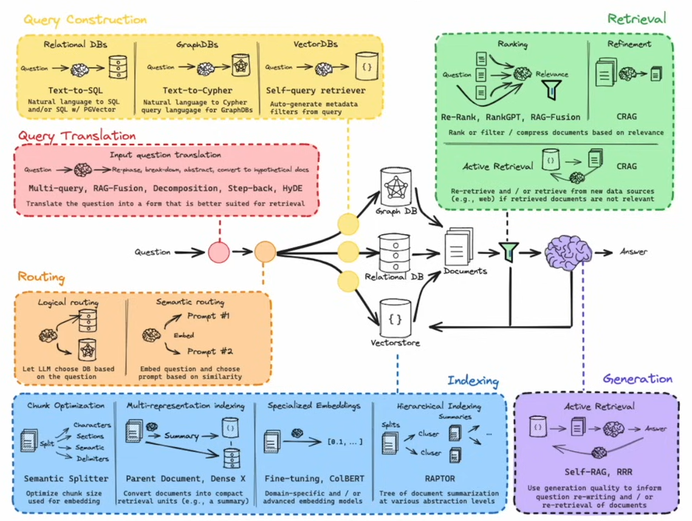

### Aprenda RAG (Retrieval-Augmented Generation) do zero com LangChain

Referência: [Learn RAG From Scratch – Python AI Tutorial from a LangChain Engineer](https://www.youtube.com/watch?v=sVcwVQRHIc8&list=WL&index=95&t=1123s)

